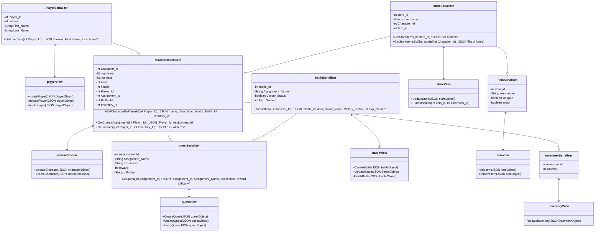

# Class Diagrams

## Front End Class Diagram

## Back End Class Diagram

```mermaid
classDiagram
 


  class PlayerSerializer{
    -int Player_Id
    -int canvas
    -String First_Name
    -String Last_Name
    +GetUserData(int Player_Id) JSON "canvas, First_Name, Last_Name"
  }


  class playerView{
    +createPlayer(JSON playerObject)
    +updatePlayer(JSON playerObject)
    -deletePlayer(JSON playerObject)
  }


  class characterSerializer{
    -int Character_Id
    -String Name
    -String class
    -int level
    -int health
    -int Player_Id
    -int Assignment_Id
    -int Battle_Id
    -int Inventory_Id
    +GetCharacterByPlayerId(int Player_Id) JSON "name, class, level, health, Battle_Id, Inventory_Id"
    +GetCurrentAssignment(int Player_Id) JSON "Player_Id, Assignment_Id"
    +GetInventory(int Player_Id, int Inventory_Id) JSON "List of items"
  }
 
  class characterView{
    +UpdateCharacter(JSON characterObject)
    +CreateCharacter(JSON characterObject)
  }


  class questSerializer{
    -int Assignment_Id
    -String Assignment_Name
    -String description
    -int reward
    -String difficulty
    +GetQuest(int Assignment_Id) JSON "Assignment_Id, Assignment_Name, description, reward, difficulty"
  }


  class questView{
    +CreateQuest(JSON questObject)
    +UpdateQuest(JSON questObject)
    -FinishQuest(JSON questObject)
  }


  class battleSerializer{
    -int Battle_Id
    -String Assignment_Name
    -boolean Victory_Status
    -int Exp_Gained
    +GetBattle(int Character_Id) JSON "Battle_Id, Assignment_Name, Victory_Status, int Exp_Gained"
  }


  class battleView{
    +CreateBattle(JSON battleObject)
    +UpdateBattle(JSON battleObject)
    -FinishBattle(JSON battleObject)
  }


  class storeSerializer{
    -int store_id
    -String store_name
    -int Character_Id
    -int item_id
    +GetStoreItems(int store_id) JSON "list of items"
    +GetStoreItemsByCharacterId(int Character_Id) JSON "list of items"
  }


  class storeView{
    +UpdateStore(JSON storeObject)
    +PurchaseItem(int item_id, int Character_Id)
  }


  class itemSerializer{
    -int item_id
    -String item_name
    -boolean weapon
    -boolean armor
  }


  class itemView{
    +AddItem(JSON itemObject)
    -RemoveItem(JSON itemObject)
  }


  class inventorySerializer{
    -int inventory_id
    -int quantity
  }


  class inventoryView{
    +updateInventory(JSON inventoryObject)
  }


  PlayerSerializer<-->playerView
  characterSerializer<-->characterView
  questSerializer<-->questView
  characterSerializer--|>questSerializer
  PlayerSerializer --|>characterSerializer
  battleSerializer <--> battleView
  battleSerializer --|>questSerializer
  storeSerializer <--> storeView
  storeSerializer --|> characterSerializer
  itemSerializer <--> itemView
  storeSerializer --|> itemSerializer
  inventorySerializer <--> inventoryView
  characterSerializer --|> inventorySerializer
```
