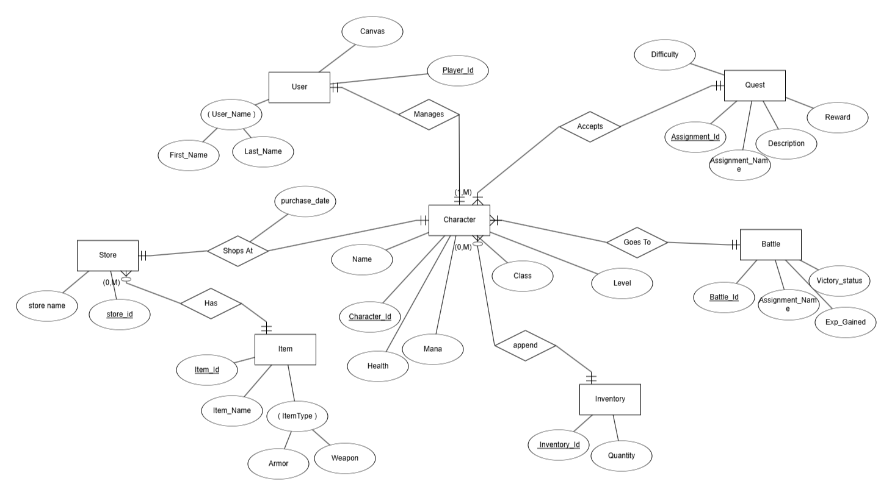
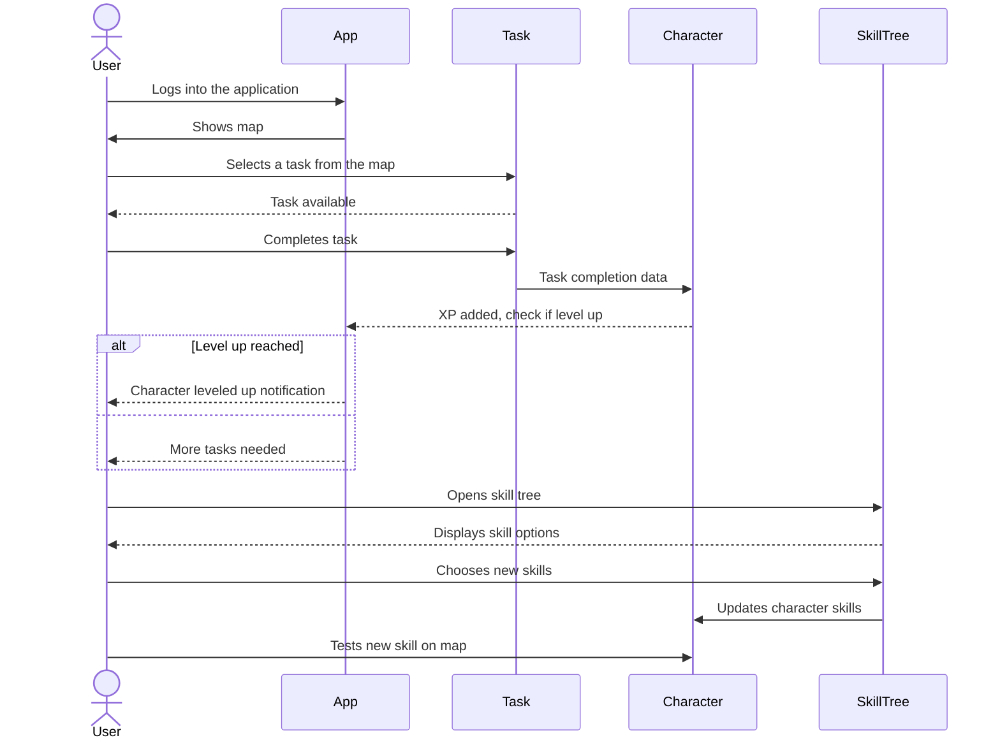
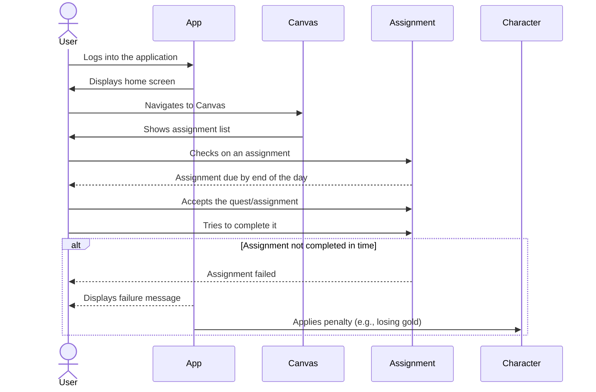
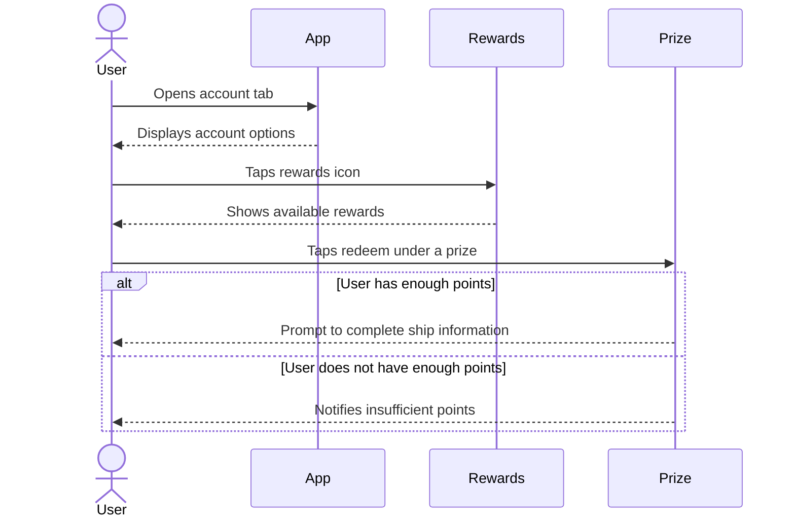
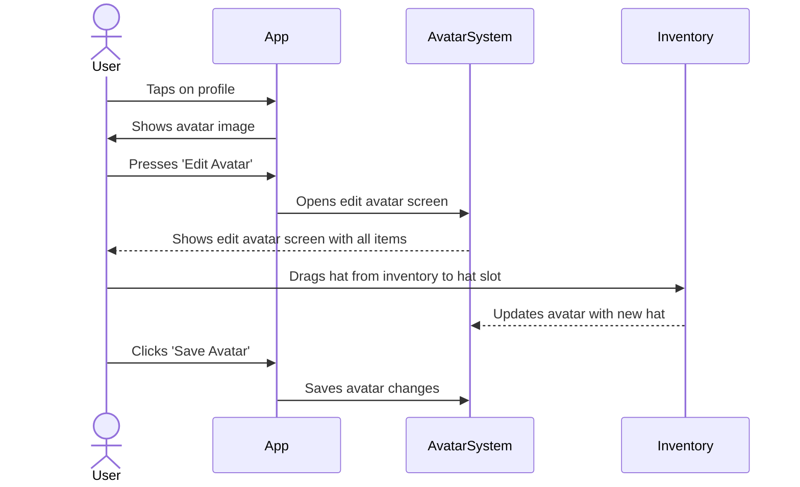

**Purpose**

The Design Document - Part I Architecture describes the software architecture and how the requirements are mapped into the design. This document will be a combination of diagrams and text that describes what the diagrams are showing.

**Requirements**

In addition to the general requirements the Design Document - Part I Architecture will contain:

A description the different components and their interfaces. For example: client, server, database.

For each component provide class diagrams showing the classes to be developed (or used) and their relationship.

Sequence diagrams showing the data flow for _all_ use cases. One sequence diagram corresponds to one use case and different use cases should have different corresponding sequence diagrams.

Describe algorithms employed in your project, e.g. neural network paradigm, training and training data set, etc.

If there is a database:

Entity-relation diagram.

Table design.

# Entity Relationship (ER) Diagram
 

# Relational Diagram
 

A check list for architecture design is attached here [architecture\_design\_checklist.pdf](https://templeu.instructure.com/courses/106563/files/16928870/download?wrap=1 "architecture_design_checklist.pdf")  and should be used as a guidance.

# Sequence Diagram

## Use case 5

**The user wants to level up and/or aim for a specific skill in their skill tree for their character.**


```
1. The user gets into the application and goes to the map to get a task.
2. User completes the task which goes towards leveling up their character.
3. Once enough tasks have been completed the character will level up, with some indication to show the user this.
4. The user goes to the skill tree tied to their character.
5. User chooses the skills that they want from the tree.
6. User confirms the skills chosen and after confirmation, the skills are part of the character.
7. The user tests out one of the new skills on the map/quest
```
## Use case 6

**A student tries to complete an assignment but fails in the given time limit.**



```
1. User logs into the app. They go to Canvas.
2. User goes to the map and checks on an assignment that is due by the end of the day.
3. The user accepts the quest/assignment and tries to complete it in time.
4. User fails to complete the assignment in time.
5. On the application, a message displays to the user that they failed.
6. A penalty is given to the user’s character due to the failure, such as losing gold.
```

## Use case 7

**User wants to trade earned points for merch.**


```
1. User wants to redeem points.
2. Goes to the account tab and taps the rewards icon.
3. Taps redeem under one of the prizes.
4. If user has necessary points then user will be prompted to fill out information on where to ship prize.
```

## Use case 8

**A student wants to put the new hat they just bought on their character.**



```
1. User will tap on their profile
2. User will then be shown an image of their avatar
3. User then presses “Edit Avatar”
4. User will be shown an edit avatar screen and all their items
5. User drags the hat they want from their inventory into the hat slot
6. User clicks “Save Avatar”
```