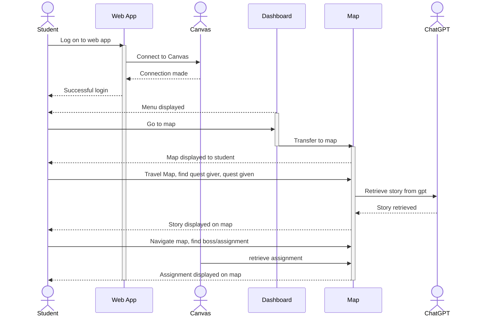
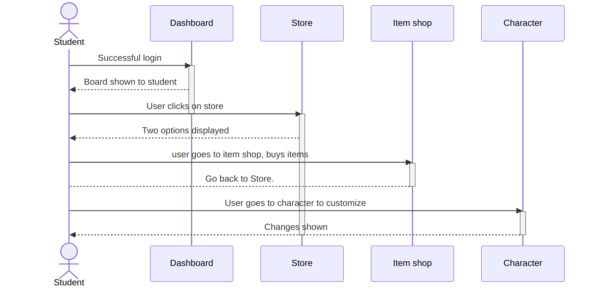
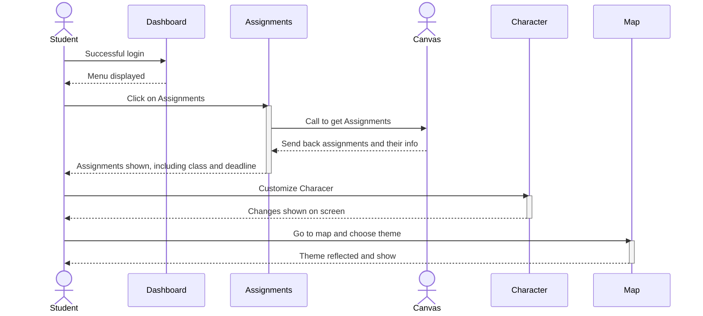
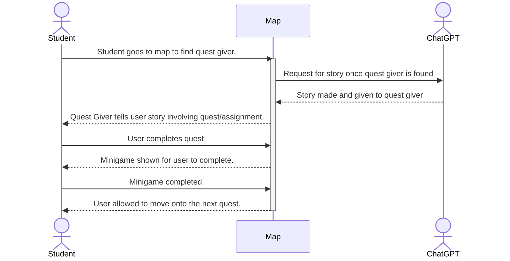
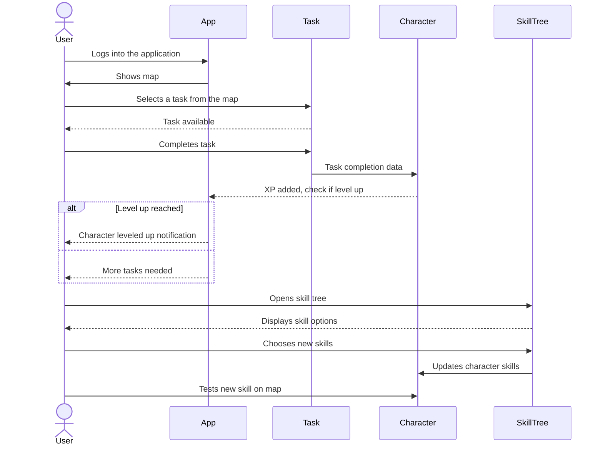
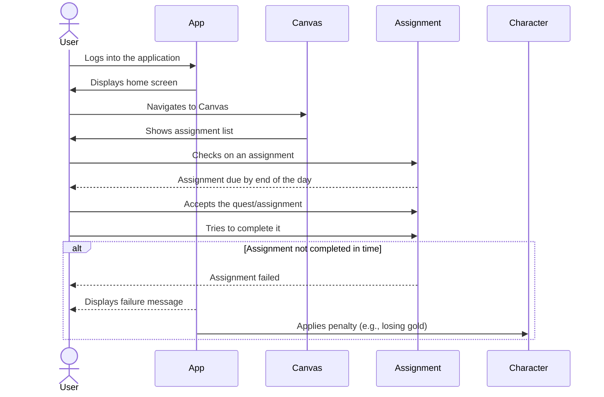
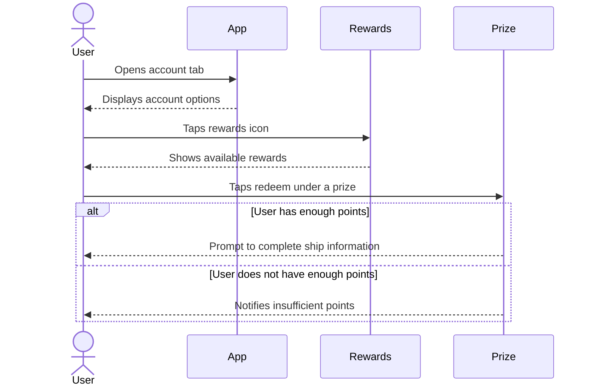
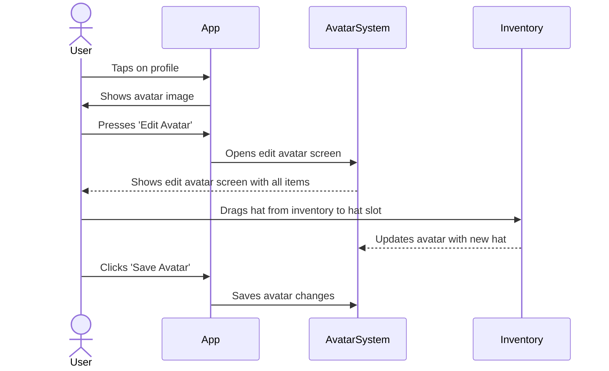

## Sequence Diagram

## Use case 1 
**As a user, I want to finish a challenging operating systems lab assignment. (Boss battle)**


```
1. After logging into the app and Canvas, the user clicks on a rpg theme to start.
2. User is then directed to a map with their avatar to navigate the world 
3. User taps on the quest finder to help reach the npc quest giver .
4. Users can read the story dialogue made from ChatGPT or choose to skip .
5. The user then navigates around the map trying to get to the Boss aka the OS lab .
6. Once the user gets to the boss, a pomodoro timer will be shown and activated.
```

## Use case 2 
**As a user, I want to buy some gear and items for my character. **


```
1. The user accumulates enough gold to buy the desired items/gear that they want. 
2. User clicks on a button icon on the map to get to the shop.
3. The user buys the items and gear that they want. Items and gears are based on different themes. 
4. User backs out of the shop and goes to their character through a different button.
5. They equip what they just bought onto their character.
6. The changes made are reflected onto the user character, including stats, and on the map. Looking fancy.

```

## Use case 3 
**As a user, I want to start up the application and prepare to start a quest.**


```
1. The user logs in to the app and connects to Canvas.
2. They download their assignments from Canvas onto a board to be organized.
3. The user organizes their assignments based on what they are in order to group them and make it more readable.
4. The user creates their basic avatar, customizing looks.
5. Afterwards, a game theme is chosen by the user to reflect the map, quests, and shop items.
```

## Use case 4 
**As a user, I want to complete a quest and go to the next one.**


```
1. The user goes to the map.
2. Using their character, the user finds a quest giver through the quest finder.
3. A bit of dialogue concerning the story made by the language model.
4. The user goes to the assignment and completes it within the given time limit.
5. After an assignment is completed, the user plays a short minigame where they can earn coins before moving onto the next assignment on the map.
```


## Use case 5

**The user wants to level up and/or aim for a specific skill in their skill tree for their character.**


```
1. The user gets into the application and goes to the map to get a task.
2. User completes the task which goes towards leveling up their character.
3. Once enough tasks have been completed the character will level up, with some indication to show the user this.
4. The user goes to the skill tree tied to their character.
5. User chooses the skills that they want from the tree.
6. User confirms the skills chosen and after confirmation, the skills are part of the character.
7. The user tests out one of the new skills on the map/quest
```
## Use case 6

**A student tries to complete an assignment but fails in the given time limit.**



```
1. User logs into the app. They go to Canvas.
2. User goes to the map and checks on an assignment that is due by the end of the day.
3. The user accepts the quest/assignment and tries to complete it in time.
4. User fails to complete the assignment in time.
5. On the application, a message displays to the user that they failed.
6. A penalty is given to the user’s character due to the failure, such as losing gold.
```

## Use case 7

**User wants to trade earned points for merch.**


```
1. User wants to redeem points.
2. Goes to the account tab and taps the rewards icon.
3. Taps redeem under one of the prizes.
4. If user has necessary points then user will be prompted to fill out information on where to ship prize.
```

## Use case 8

**A student wants to put the new hat they just bought on their character.**



```
1. User will tap on their profile
2. User will then be shown an image of their avatar
3. User then presses “Edit Avatar”
4. User will be shown an edit avatar screen and all their items
5. User drags the hat they want from their inventory into the hat slot
6. User clicks “Save Avatar”
```
